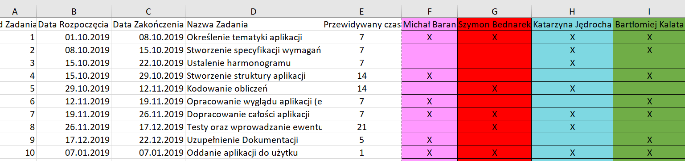

# Dokumentacja aplikacji 
## Podział pracy
### Początkowo zakładany podział pracy oraz harmonogram prezentują się następująco:

 
Zakładany podział sprawdził się podczas okresu realizacji projektu. Wszyscy członkowie mieli jasno sprecyzowane swoje role i zadania, które konsekwentnie realizowali. W trakcie tworzenia projektu nie nastąpiły żadne znaczące różnice pomiędzy stanem faktycznym a tym zakładanym na początku. Strukturą aplikacji zajęli się Michał Baran oraz Bartłomiej Kalata, podczas gdy za implementacje i poprawność obliczeń odpowiadali Szymon Bednarek oraz Katarzyna Jędrocha. Drobne zmiany pojawiły się przy testowaniu aplikacji oraz tworzeniu dokumentacji. Z powodu większej dostępności czasowej w danym okresie, poprawianiem błędów, które pojawiły się podczas testowania aplikacji oprócz Szymona Bednarka zajął się również Michał Baran, który nie był początkowo przypisany do tego etapu. Katarzyna Jędrocha, która była odpowiedzialna za tą część, stworzyła dokumentacje projektu razem z Bartłomiejem Kalatą, która początkowo była przypisana również do Michała Barana. 

## Harmonogram początkowy i faktyczny

Wszyscy członkowie zespołu pracowali zgodnie z ustalonym harmonogramem dlatego też żadne z zadań nie trwało dłużej niż przewidziano. Harmonogram ten, stworzony na początku projektu, zakładał oddanie ostatecznej wersji aplikacji w terminie 07.01.2020r. W rzeczywistości była ona gotowa 10.12.2019r. z powodu krótszego niż początkowo zakładano czasu testowania aplikacji i wprowadzania ewentualnych poprawek. W trakcie procesu testowania nie wykryto większych błędów, jedynie drobne poprawki które zostały wprowadzone bezpośrednio po wykryciu nieścisłości, co zdecydowanie ograniczyło zakładany czas pracy w tej części, który wynosił 3 tygodnie. Kodowanie obliczeń zajęło również mniej niż przewidywane 2 tygodnie, dlatego finalny czas oddania projektu jest o miesiąc wcześniej niż początkowo zakładano. 

## Opis początkowego stadium projektu- wybór tematyki oraz technologii.

Pomysł na projekt w formie w jakiej powstał związany jest z analityczną częścią kierunku studiów, który realizujemy. Teoretyczne podstawy metod wielowymiarowej analizy danych, które zostały zaimplementowane w tej aplikacji zostały nam przedstawione na jednym z przedmiotów realizowanych w toku studiów- Statystycznej analizie danych. Jako iż metody te zainteresowały członków grupy projektowej i zostaną wykorzystane przez niektórych do badań w ramach pracy licencjackiej, zdecydowano się na stworzenie aplikacji o takim właśnie charakterze. Technologia w jakiej stworzono projekt to język R. Został on wybrany ze względu na dostępne pakiety do statystycznej analizy danych, które są bardzo dobrze rozwinięte i opisane. Każdy z członków zespołu miał wcześniej styczność z tym językiem, dlatego jego wybór pozwalał na równomierny podział pracy w grupie oraz możliwość pomocy pozostałych osób w razie problemów z danym zadaniem.

## Funkcjonalność aplikacji

Za sprecyzowanie poszczególnych funkcjonalności aplikacji odpowiedzialni byli wszyscy członkowie zespołu. Stworzony projekt cechują następujące funkcjonalności:

  1.	Wczytywanie danych z pliku
  2.	Wybór odpowiednich zmiennych z pliku branych pod uwagę przy tworzeniu rankingu
  3.	Wybór charakteru danych zmiennych (stymulanta bądź destymulanta)
  4.	Wybór metod tworzenia rankingu
  5.	Zapoznanie się z charakterem poszczególnych metod porządkowania liniowego
  6.	Zastosowanie poprawnej formuły matematycznej do obliczenia rządanego przez użytkownika rankingu 
  7.	Wyświetlenie rezultatów w postaci tabeli odpowiadających poszczególnym zastosowanym metodom 
  8.	Zapis wybranych wyników do pliku
 
## Kod aplikacji – omówienie zastosowanych rozwiązań

Kod w aplikacji składa się z dwóch głównych bloków:

 * strukturty aplikacji webowej shiny
 
 * zaimplementowanych matematycznych metod tworzenia rankingów
 
Taka struktura kodu sprawia, że jest on czytelny i prosty w edycji. W przypadku pojawiających się błędów lub potrzebnych aktualizacji aplikacji, łatwo można wyszukać fragment kodu odpowiedzialny za daną funkcjonalność i przystosować go do potrzeb użytkownika.Struktura aplikacji została podzilona na panele, a stylistyka została wykonana poprzez wykorzystanie elementów CSS'a, dzięki czemu program jest intuicyjny i przyjazny dla użytkownika.
Wszystkie metody wielowymiarowej analizy danych (TOPSIS, Hellwig, Standaryzowanych sum oraz Rang) zostały zaimplementowane samodzielnie przy pomocy specjalnych pakietów pozwalających na zoptymalizowanie procesów obliczeniowych.  

## Projektowanie aplikacji

### Tworzenie struktury

Za tworzenie struktury aplikacji odpowiedzialni byli Baran Michał oraz Bartłomiej Kalata. Struktura aplikacji została podzielona na 3 główne części:

 *	OPIS
 
 *	DANE
 
 * STATYSTYKI
 
 *	RANKING

### OPIS

Sekcja OPIS stworzona została przez Katarzynę Jędrocha. W sekcji OPIS znajdują się opisy metod użytych do tworzenia rankingów m.in.: Metoda HELLWIGA, TOPSIS, SUMY RANG, STANDARYZOWANYCH SUM. Dzięki tej sekcji Użytkownik zostaje wprowadzony w metody które zostaną użyte do stworzenia rankingów na podstawie jego danych, w taki sposób, aby mógł dobrać najlepiej pasującą do jego zbioru. W każdym z opisów wymienione są wady i zalety metod oraz ich chrakterystyczne cechy.

### DANE

Sekcja DANE podzielona jest na dwie części:
- część nawigacyjna
- część główna

#### Część główna

 •	Przycisk wczytania danych Browse... . Po uruchomieniu ukazuje się okno wyboru pliku źródłowego, w którym należy wybrać dane do stworzenia rankingu.

 •	Częścią główną tej sekcji jest podgląd danych. Jest to reaktywna tabela ukazująca podgląd wybranych danych "na żywo". Dzięki temu dane ukazują się tylko w taki sposób, w jaki użytkownik wybrał w sekcji nawigacyjnej.

#### Część nawigacyjna

 •	Po lewej stronie w sekcji nawigacyjnej znajduje się Wybór zmiennych. W sekcji tej można wybrać tylko te zmienne, które według użytkownika najlepiej pasują do stworzenia rankingu według wybranej metody.

 •	Kolejną częścią sekcji nawigacyjnej jest Wybór stymulant. Stymulanty to te zmienne które w dodatni lub pozytywny sposób wpływają na pozycję danego obiektu w rankingu. To znaczy, im większa jest zmienna uznana przez użytkownika za stymulantę, tym większe są szanse na wyższą pozycję w rankingu danego obiektu. Część ta jest dostosowywana "na żywo". Oznacza to że wybór czy zmienna może być stymulantą, ukaże się dopiero po wyborze tej zmiennej w powyższej sekcji.

### STATYSTYKI
W sekcji STATYSTYKI znaleźć możemy statystyki opisowe dla każdej zmiennej wybranej po wczytaniu danych. 
Lista dostępnych statystyk:

* n - liczba obserawcji
* mean - średnia wartość
* sd - odchylenie standardowe
* median - mediana
* trimmed - średnia ucinana
* mad - średnie odchylenie standardowe
* min - wartość mininalna
* max - wartość maksymalna
* range - rozpiętość danych (różnica między wartością minimalną, a maksymalną)
* skew - skośność
* kurtosis - kurtoza
* se - błąd standardowy

### RANKING

W sekcji RANKING znajdują się : 
Każdy z rankingów wyświetlany jest w postaci tabeli. Do wyświetlenia wyników został użyty pakiet DT, pozwala on na swobodne manipulowanie wyglądem, wielkością oraz stylem tabeli. Ponadto umożliwia on wyszukiwanie pozycji w tabeli. Każda z tabeli przedstawia:

 •	nazwę obiektu
 •	wartość która została obliczona daną metodą
 •	pozycję rankingu
 •	4 metody w nawigacji, gdzie do wyboru jest podgląd rankingu stworzonego przez daną metodę.
 •	Przycisk zapisu rankingu do pliku.

## Implikacja Obliczeń

Za tworzenie obliczeń i implikowanie ich do aplikacji odpowiedzialni byli Katarzyna Jędrocha oraz Szymon Bednarek.
Obliczenia zostały wykonane zgodnie z metodyką Statystycznej Analizy Danych. Dzięki temu udało się uzyskać proste algorytmy, tworzące rankingi w sposób zgodny teorią.

## Tworzenie GUI

Za tworzenie GUI odpowiedzialni byli, Michał Baran oraz Bartłomiej Kalata. GUI zostało stworzone w specjalnie przeznaczonym do tego pakiecie R: SHINY. Pozwala on na tworzenie aplikacji reagujących na żywo. GUI zostało podzielone na 3 główne sekcje tak aby użytkownik mógł przejść przez tzw. "ścieżkę", od wyboru danych, poprzez ich edycję, aż do gotowego produktu jakim jest ranking zapisany do pliku.

## Testy aplikacji

Za testy aplikacji odpowiedzialni byli wszyscy członkowie zespołu. Pierwszym z przeprowadzonych testów był test użytkowy. Podczas testowania każdego z elementów wykazano następujące błędy:

*	Tablice w sekcji RANKINGI nie wyświetlały się w prawidłowy sposób. Rozwiązanie: Zastosowanie biblioteki "DF".

*	Podczas wybrania tylko jednej zmiennej, podgląd danych w sekcji DANE, nie wyświetlał się prawidłowo. Rozwiązanie: Napisanie funkcji obsługującej dany błąd.

* Ranking wykonywany metodą TOPSIS nie brał pod uwagę czy zmienne są stymulantami. Rozwiązanie: Zmienia sposobu deklaracji stymulant.

* Statystyki opisowe wyświetlały się dla wszsytkich zmiennych niezależnie od wybranych elelmentów. Rozwiązanie: Wydzielenie osobnej tablicy danych tylko z "zaznaczonymi" zmiennymi.

* Plik z zapisem rankingu generował się w niedopowiednim folderze. Rozwiązanie: Stworzenie funkcji zapisu o określoną ścieżką zapisu.

Wszystkie powyższe błędy zostały szybko poprawione poprzez zastosowanie powyższych rozwiązań przez Szymona Bednarka oraz Michała Barana. 
Po poprawieniu wszystkich błędów aplikacja została przetestowana ponownie i nie wykazano żadnych błędów użytkowych.

## Dokumentacja 

Dokumentacja została wykonana przez Bartłomieja Kalata oraz Katarzynę Jędrocha.

